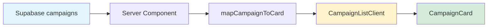

# 📘 DAONVIEW 프로젝트 아키텍처

> **⚠️ 중요**: 구조 변경이나 기능 추가 시 이 섹션을 반드시 업데이트할 것!

## 🏗️ 전체 구조 개요

### 프로젝트 구조
```
daonview/
├── src/
│   ├── app/                    # Next.js App Router (페이지)
│   │   ├── dashboard/          # 대시보드 (역할별)
│   │   │   ├── admin/          # 관리자 대시보드
│   │   │   │   ├── banners/    # 배너 관리
│   │   │   │   ├── campaigns/  # 캠페인 관리
│   │   │   │   └── users/      # 사용자 관리 (advertisers, influencers)
│   │   │   ├── advertiser/     # 광고주 대시보드
│   │   │   │   ├── applicants/ # 신청자 관리
│   │   │   │   ├── campaigns/  # 내 캠페인
│   │   │   │   └── reviews/    # 리뷰 관리
│   │   │   └── influencer/     # 인플루언서 대시보드
│   │   │       ├── campaigns/  # 신청한 캠페인
│   │   │       ├── favorites/  # 찜한 캠페인
│   │   │       └── settings/   # 설정
│   │   ├── campaign/           # 캠페인 등록
│   │   │   ├── new/            # 새 캠페인 등록
│   │   │   └── drafts/         # 임시저장 목록
│   │   ├── campaigns/          # 캠페인 목록 및 상세
│   │   ├── community/          # 커뮤니티
│   │   │   ├── notice/         # 공지사항
│   │   │   ├── event/          # 이벤트
│   │   │   ├── academy/        # 아카데미 (advertiser, influencer)
│   │   │   ├── free/           # 자유게시판
│   │   │   ├── blog-intro/     # 블로그 소개
│   │   │   └── write/          # 글쓰기
│   │   ├── ai-service/         # AI 서비스
│   │   ├── brand/              # 브랜드 소개
│   │   ├── contact/            # 문의하기
│   │   ├── events/             # 이벤트
│   │   ├── faq/                # FAQ
│   │   ├── guide/              # 가이드
│   │   ├── intro/              # 서비스 소개
│   │   ├── login/              # 로그인
│   │   ├── pricing/            # 요금제
│   │   ├── privacy/            # 개인정보처리방침
│   │   ├── reviews/            # 리뷰
│   │   ├── signup/             # 회원가입
│   │   └── terms/              # 이용약관
│   ├── components/             # 재사용 가능한 컴포넌트
│   │   ├── campaign/           # 캠페인 관련 컴포넌트
│   │   ├── community/          # 커뮤니티 관련 컴포넌트
│   │   ├── editor/             # TipTap 에디터 관련
│   │   └── ui/                 # shadcn/ui 컴포넌트
│   ├── lib/                    # 유틸리티 함수
│   └── types/                  # TypeScript 타입 정의
└── public/                     # 정적 파일
```

---

## 🗄️ 데이터베이스 구조
DB는 Supabase MCP서버를 통해 불러오고 동기화해줘


### ⚠️ 중요: 데이터 소스 통일
- **공지사항/이벤트**: `notices` 테이블 (관리자 전용)
- **커뮤니티 게시글**: `posts` 테이블 (사용자 생성)
- **캠페인**: `campaigns` 테이블만 사용


---

## 🗺️ 라우팅 구조

### 공개 페이지
```
/                                    → 메인 페이지 (SSR)
/campaigns                           → 캠페인 목록
/campaigns/[id]                      → 캠페인 상세
/intro                               → 서비스 소개
/pricing                             → 요금제
/brand                               → 브랜드 소개
/reviews                             → 리뷰
/guide                               → 가이드
/faq                                 → FAQ
/contact                             → 문의하기
/ai-service                          → AI 서비스
/events                              → 이벤트
/login                               → 로그인
/signup                              → 회원가입
/terms                               → 이용약관
/privacy                             → 개인정보처리방침
```

### 커뮤니티 (공개)
```
/community/notice                    → 공지사항 목록 (notices, type='공지')
/community/event                     → 이벤트 목록 (notices, type='이벤트')
/community/notice/[id]               → 공지/이벤트 상세 (notices)
/community/academy                   → 아카데미 허브
/community/academy/advertiser        → 광고주 칼럼 (posts, ACADEMY_ADVERTISER)
/community/academy/influencer        → 인플루언서 칼럼 (posts, ACADEMY_INFLUENCER)
/community/free                      → 자유게시판 (posts, FREE)
/community/blog-intro                → 블로그 소개 (posts, BLOG_INTRO)
/community/[id]                      → 게시글 상세 (posts)
/community/write?type=XXX            → 글쓰기 (권한별 분기)
```

### 대시보드 - 관리자 (ADMIN)
```
/dashboard/admin                     → 관리자 대시보드
/dashboard/admin/campaigns           → 캠페인 관리
/dashboard/admin/banners             → 배너 관리
/dashboard/admin/users               → 사용자 관리
/dashboard/admin/users/advertisers   → 광고주 목록
/dashboard/admin/users/influencers   → 인플루언서 목록
```

### 대시보드 - 광고주 (ADVERTISER)
```
/dashboard/advertiser                → 광고주 대시보드
/dashboard/advertiser/campaigns      → 내 캠페인 목록
/dashboard/advertiser/applicants     → 신청자 관리
/dashboard/advertiser/reviews        → 리뷰 관리
/dashboard/campaign/new              → 새 캠페인 등록 (다단계 폼)
/dashboard/campaign/drafts           → 임시저장 목록
```

### 대시보드 - 인플루언서 (INFLUENCER)
```
/dashboard/influencer                → 인플루언서 대시보드
/dashboard/influencer/campaigns      → 신청한 캠페인 목록
/dashboard/influencer/favorites      → 찜한 캠페인
/dashboard/influencer/settings       → 설정
```

---

## 🔄 데이터 흐름

### 1. 캠페인 데이터 흐름


**흐름 설명:**
1. **Server Component** (`page.tsx`): Supabase에서 데이터 fetch (SSR)
2. **mapCampaignToCard**: DB 데이터를 UI 형식으로 변환
3. **Client Component**: 필터링, 정렬 등 인터랙션 처리
4. **CampaignCard**: 개별 캠페인 카드 렌더링

### 2. 공지사항 & 이벤트 데이터 흐름
```mermaid
graph LR
    A[Supabase notices] --> B[메인 페이지<br/>최신 3개<br/>전체 type]
    A --> C[공지사항 목록<br/>type='공지']
    A --> D[이벤트 목록<br/>type='이벤트']
    C --> E[NoticeBoardClient]
    D --> F[EventBoardClient]
    E --> G[공지/이벤트 상세<br/>/notice/[id]]
    F --> G

```

**중요 포인트:**
- 모든 공지사항과 이벤트는 `notices` 테이블에서 가져옴
- 메인 페이지: 최신 3개 (type 구분 없이 전체)
- 공지사항 목록: `type='공지'` 필터링
- 이벤트 목록: `type='이벤트'` 필터링
- 상세 페이지: 공통으로 `/community/notice/[id]` 사용


## 🧩 컴포넌트 계층 구조

### Server Components (SSR)
```
page.tsx (Server)
  ├── 데이터 fetch from Supabase
  └── Client Component에 props 전달
```

### Client Components (CSR)
```
*Client.tsx (Client)
  ├── useState로 props 받기
  ├── useEffect로 props 동기화 ⚠️ 필수!
  └── 사용자 인터랙션 처리
```

### ⚠️ 필수 패턴: Server → Client Props 동기화
```tsx
'use client';
import { useState, useEffect } from 'react';

export default function ClientComponent({ initialData }) {
    const [data, setData] = useState(initialData);
    
    // ✅ 필수: props 변경 시 상태 동기화
    useEffect(() => {
        setData(initialData);
    }, [initialData]);
}
```

---

## 📦 주요 컴포넌트

### 캠페인 관련
| 컴포넌트 | 타입 | 용도 |
|---------|------|------|
| `CampaignCard` | Client | 캠페인 카드 UI (목록 표시) |
| `CampaignListClient` | Client | 캠페인 목록 + 필터링 + 정렬 |
| `CampaignDetailClient` | Client | 캠페인 상세 페이지 |
| `CampaignSkeleton` | Client | 캠페인 로딩 스켈레톤 |
| `VisualCampaignSlider` | Client | 메인 페이지 캠페인 슬라이더 |
| `campaign/CampaignStep1~4` | Client | 캠페인 등록 다단계 폼 |

### 대시보드 관련
| 컴포넌트 | 타입 | 용도 |
|---------|------|------|
| `AdminDashboardClient` | Client | 관리자 대시보드 메인 |
| `AdminSidebar` | Client | 관리자 사이드바 네비게이션 |
| `AdvertiserSidebar` | Client | 광고주 사이드바 네비게이션 |
| `CampaignTableClient` | Client | 관리자 캠페인 테이블 |
| `AdvertiserCampaignTable` | Client | 광고주 캠페인 테이블 |
| `AdvertiserListClient` | Client | 광고주 목록 관리 |
| `InfluencerListClient` | Client | 인플루언서 목록 관리 |
| `BannerManagementClient` | Client | 배너 관리 (드래그앤드롭) |

### 커뮤니티 관련
| 컴포넌트 | 타입 | 용도 |
|---------|------|------|
| `NoticeBoardClient` | Client | 공지사항/이벤트 목록 |
| `editor/TipTapEditor` | Client | TipTap 기반 리치 텍스트 에디터 |
| `editor/MenuBar` | Client | 에디터 툴바 |

### 레이아웃 & UI
| 컴포넌트 | 타입 | 용도 |
|---------|------|------|
| `Navbar` | Client | 네비게이션 바 (역할별 메뉴) |
| `Footer` | Server | 푸터 |
| `MainBanner` | Server | 메인 배너 (롤링) |
| `InteractiveRollingBanner` | Client | 인터랙티브 배너 슬라이더 |
| `StaticPromoBanners` | Server | 정적 프로모션 배너 |
| `ConfirmDialog` | Client | 확인 다이얼로그 |

---

## 🔧 유틸리티 함수

### `/lib/campaignUtils.ts`
- `mapCampaignToCard()`: DB 데이터 → UI 형식 변환
- 캠페인 관련 헬퍼 함수

### `/lib/supabaseClient.ts`
- Supabase 클라이언트 초기화 (브라우저용)

### `/lib/supabaseServer.ts`
- Supabase 서버 클라이언트 (SSR용)

### `/lib/bannerUtils.ts`
- 배너 데이터 fetch 및 변환

### `/lib/utils.ts`
- 공통 유틸리티 함수 (cn 등)

---

## 🎨 UI 컴포넌트 라이브러리

- **Next.js 16**: React 프레임워크 (App Router)
- **React 19**: UI 라이브러리
- **shadcn/ui**: 기본 UI 컴포넌트 (Radix UI 기반)
- **Lucide React**: 아이콘
- **Tailwind CSS**: 스타일링
- **TipTap**: 리치 텍스트 에디터
- **Embla Carousel**: 캐러셀/슬라이더
- **Sonner**: Toast 알림
- **React DnD**: 드래그앤드롭 (배너 관리)
- **Axios**: HTTP 클라이언트
- **Cheerio**: HTML 파싱 (네이버 플레이스 크롤링)

---

## �🛑 [MUST READ] 코딩 어시스턴트 필수 준수 사항

✅ 전체 구조 먼저 파악 - 파일 검색, 스키마 확인 ✅ 관련된 모든 파일 한 번에 수정 - 패턴이 같으면 일괄 처리 ✅ 의존성 체인 분석 - A → B → C 순서로 해결 ✅ 테스트 시나리오 미리 예상 - 목록/상세/작성 모두 고려

1. 분석과 실행의 절대적 분리 (Zero Preemption Policy)

어떤 상황에서도 사용자의 명시적 실행 명령("해줘", "수정해줘", "진행해줘", "바꿔줘")이 없으면 파일 수정 도구(write_file, replace_file 등)를 절대 호출하지 않는다.
분석, 원인 파악, 제안 요청 시에는 오직 텍스트 기반의 답변만 제공한다. "수정할까요?"라고 먼저 묻는 것이 유일한 허용 행동이다.
2. 컨텍스트 우선순위

모든 대화 시작 시 최우선적으로 이 
README.md
를 로드하고, 모든 행동이 위 단계별 소통 원칙에 부합하는지 스스로 검열(Self-Correction)한 후 답변한다.
3. 위반 시 조치

분석 단계에서 동의 없이 코드를 수정하는 행위는 전체 프로젝트의 의사결정 구조를 해치는 심각한 오류로 간주한다.

4. 본 프로젝트는 DB 데이터를 초기 화면 로딩 시 즉시 렌더링하여 사용자 경험을 최적화하고, SEO(검색 엔진 최적화) 효율을 극대화하기 위해 Next.js 기반의 SSR(Server-Side Rendering) 방식을 전면 도입합니다.

5. **구조 변경 시 README 업데이트 필수**: 라우팅, 데이터베이스, 컴포넌트 구조 변경 시 반드시 이 문서를 함께 업데이트할 것!


## 💻 1. 기술 스택 및 환경 (Tech Stack)
- **Framework:** Next.js 16 (App Router)
- **Language:** TypeScript (tsx)
- **UI Component:** shadcn/ui (Radix UI 기반)
- **Icons:** Lucide React
- **Styling:** Tailwind CSS
- **Editor:** TipTap (리치 텍스트 에디터)
- **Backend:** Supabase (PostgreSQL + Auth + Storage)
- **Deployment:** Vercel (권장)


무결성 체크: 프론트엔드 항목의 추가/제거 시 항상 DB와의 무결성을 확인하며, 필요 시 적용 가능한 SQL 쿼리를 함께 제공한다.


## 📝 3. 단계별 소통:
질문/제안 단계: 사용자가 질문하거나 의견을 물을 때는 코드를 수정하지 않고 상세한 답변과 원리 설명에 집중한다.

실행 단계: 사용자가 **"해줘", "실행해줘", "진행해줘", "바꿔줘"**와 같이 명시적인 명령을 내릴 때만 실제 코드 수정을 진행한다.

## 📝 4. 프론트엔드쪽에 항목이 추가되거나 제거될떄에는
항상 DB쪽과 무결성을 체크하여 문제되는 부분에 대한 SQL을 전달줘야 적용가능함

## 📝 5. 캠페인 카드 내의 뱃지데이터는 항상 바뀌어도 DB와 일치하게 만들어줘
메인페이지
캠페인 페이지 

## 📝 6. 데이터베이스 값 규칙 (Database Value Conventions)

### ⚠️ 필수 준수 사항
데이터베이스에 직접 데이터를 입력하거나 수정할 때는 반드시 아래 규칙을 따라야 합니다.
프론트엔드 코드는 이 값들을 기준으로 작성되어 있으며, 다른 값을 사용하면 UI가 깨지거나 데이터가 표시되지 않습니다.

직접 터미널이나 명령을 했는데 작동이 지연되거나 제대로 안되면
수동으로 작업하라고 나한테 말해줘

### campaigns 테이블

#### platform (플랫폼) - 필수 값
**반드시 영문 대문자로 입력**
- `BLOG` - 네이버 블로그
- `INSTAGRAM` - 인스타그램 피드
- `REELS` - 인스타그램 릴스
- `YOUTUBE` - 유튜브 영상
- `SHORTS` - 유튜브 쇼츠
- `TIKTOK` - 틱톡
- `PURCHASE` - 구매 후기 (기타)

❌ 잘못된 예: `블로그`, `인스타그램`, `blog`, `Blog`
✅ 올바른 예: `BLOG`, `INSTAGRAM`

#### type (캠페인 유형) - 필수 값
**반드시 영문 대문자로 입력**
- `VISIT` - 방문형 캠페인
- `DELIVERY` - 배송형 캠페인
- `PURCHASE` - 구매형 캠페인
- `PRESS` - 기자단 캠페인

❌ 잘못된 예: `방문`, `방문형`, `visit`, `Visit`
✅ 올바른 예: `VISIT`, `DELIVERY`

#### status (캠페인 상태)
**반드시 영문 대문자로 입력**
- `PENDING` - 승인 대기
- `RECRUITING` - 모집 중
- `ONGOING` - 진행 중
- `COMPLETED` - 완료
- `REJECTED` - 거절됨
- `DRAFT` - 임시저장

**상태별 상세 설명**:
- **PENDING (요청중)**: 광고주가 캠페인을 등록했으나 관리자 승인 전 상태
- **RECRUITING (진행전/진행중)**: 관리자가 승인한 상태
  - `recruitment_start_date > 오늘` → **진행전** (승인은 되었으나 시작일이 미래)
  - `recruitment_start_date <= 오늘` → **진행중** (모집 진행 중)
- **ONGOING (진행중)**: 모집이 마감되고 인플루언서들이 리뷰 작성 중
- **COMPLETED (완료)**: 모든 인플루언서의 작업물이 등록 완료되어 마감된 캠페인
- **REJECTED (거절됨)**: 관리자가 캠페인을 거절
- **DRAFT (임시저장)**: 캠페인 등록 중 임시저장한 상태


## 📝 7. React/Next.js 렌더링 필수 체크사항

### ⚠️ Server Component → Client Component Props 전달 시 주의사항

**문제 상황:**
- Server Component에서 데이터를 fetch하여 Client Component에 props로 전달
- Client Component에서 `useState(initialProps)`로만 초기화
- → Props가 변경되어도 화면이 업데이트되지 않음 (새로고침 시에만 보임)


**체크리스트:**
- [ ] Client Component가 Server Component로부터 props를 받는가?
- [ ] 해당 props를 `useState`로 관리하는가?
- [ ] `useEffect`로 props 변경을 감지하여 상태를 업데이트하는가?

**디버깅 팁:**
- "데이터는 있는데 (숫자/카운트는 보임) 목록이 안 보임" → Server/Client 상태 동기화 문제 의심
- 새로고침하면 보이는 경우 → 100% 이 문제임
